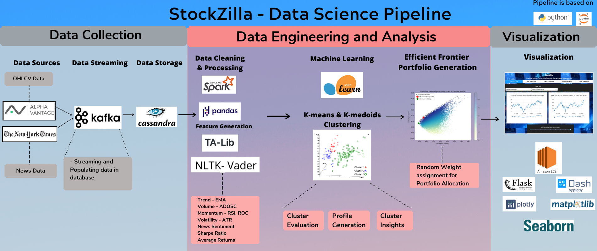
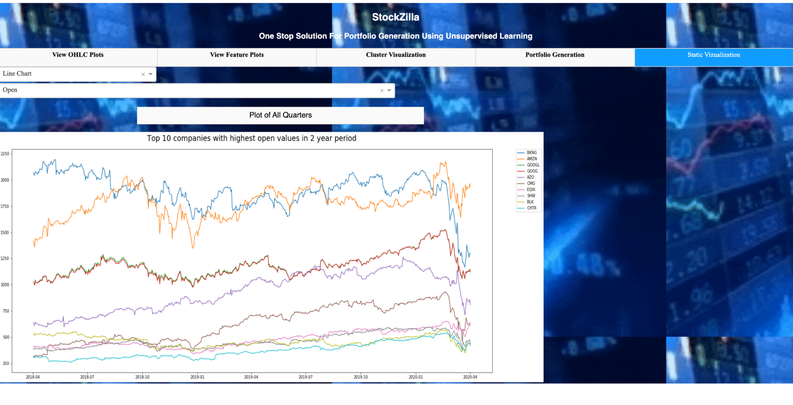

# StockZilla
## One stop solution to stocks portfolio generation using unsupervised learning techniques. ##

Sound knowledge of stock market data and the latest news trends is very essential for a financial advisor or an investor for making investment decisions in the stock market. The stock market is a domain that is very volatile and the stock trends keep varying over time. The collective reason why all this variation is seen in the market is due to multiple factors such as the emotion of a people buying and selling the stocks, common news sentiments of the stock market, company news and also a staunch belief that the company will do well considering the fact that it has been doing good in the past few months/quarters. Inspite of knowing all this, sometimes the stocks we buy may plunge down just because of one small news about COVID-19 that caused a negative sentiment across the market or skyrocket the values of stock because the company made profits better than the analyst's prediction for that time period. Identifying the right set of moves to generate a diversified stock portfolio that mitigates the risk of financial loss is still an area of active research. Thus, forming the motivation for our project.

## Data Pipeline

 
## Getting Started

These instructions will get you a copy of the project up and running on your local machine for development and testing purposes. See deployment for notes on how to deploy the project on a live system.

### Prerequisites

The following packages need to be installed and must be running. 

```
pyspark
cassandra
pandas
talib
dash
flask
dash_core_components
dash_html_components
colorlover
plotly
```

### Running the Code

Download the project or clone the project using the below line.
```
git clone https://csil-git1.cs.surrey.sfu.ca/akalliha/stock-portfolio-management.git
```

Open a terminal and start Cassandra server using the following command:
```
cassandra -f
```
We can then perform all the database operations in the successive instructions with the Cassandra server running on this terminal.

### Streaming

#### Startup Script
For streaming data, Navigate to ```/Code/Streaming/``` and run the ```startup_script.sh``` using the following command
```
sudo ./startup_script.sh
```

This scripts starts the Zookeeper server, Kafka server and Cassandra server in background

#### Publishing data

There are three producer methods to publish OHLCV data, common news data and company news data. 
When ```single_producer.py``` is executed, a KafkaProducer object is created. 
The schedule object then calls the 3 methods and the KafkaProducer object is passed to these methods. 
Each of these methods make an appropriate API call, select the most suitable data and publish the data in their respective topic. 

For publishing Kafka streams, navigate to ```/Code/Streaming/producer/``` and run ```single_producer.py``` file
```
python single_producer.py
```

Now, for consuming these topics, open a new terminal window, navigate to ```Code/Streaming/consumer```

#### Consuming and Storing data into Cassandra

There are 2 consumer methods, ohlcv_consumer and news_consumer. 
For each of the topic, a consumer creates Cassandra tables if not already exists, parses the data, and then stores the data in the respective tables in the requried format.

For inserting company news data to Cassandra, run ```news_consumer.py``` file as follows
```
python news_consumer.py company_news
```

For inserting company news data to Cassandra, run ```news_consumer.py``` file as follows
```
python news_consumer.py common_news
```

For adding OHLCV data to Cassandra, run ```ohlcv_consumer.py``` file
```
python ohlcv_consumer.py
```

### Data Acquisition
The data was acquired from AlphaVantage API and New York Times API. 
The json files obtained from New York Times API are stored in the ```Common_news``` and ```Company_news``` directories.
To generate the common news data files, run ```nytimes-common_data.py``` file in ```Data-Acquisition/news-data/``` directory
To generate the common news data files, run ```nytimes.py``` file in ```Data-Acquisition/news-data/``` directory

The raw data is acquired from API calls and stored in Cassandra database.
Navigate to data_operations directory to the project directory as follows.

```
cd Code/data_operations
```

uncomment the line below in ```data_operations.py``` which creates and populates all the required tables in the Cassandra database.

```
generate_all_necessary_tables_at_once()

```

Use the below line to run ```data_operations.py```

```
spark-submit --packages datastax:spark-cassandra-connector:2.4.0-s_2.11 data_operations.py
```

The data will then be stored in database for all the further activites.

### Create features

Navigate to ```data_operations``` directory in the project as follows.

```
cd Code/data_operations
```

Run the ```input_features.py``` file to generate the input features.
```
spark-submit --packages datastax:spark-cassandra-connector:2.4.0-s_2.11 input_features.py
```

#### OHLCV EDA

To understand the OHLCV data, you can execute the ```eda.ipynb``` file in ```EDA``` directory

#### OHLCV Feature EDA

To understand the OHLCV data, you can execute the ```features_eda.ipynb``` file in ```EDA``` directory

#### News Feature EDA

To understand the OHLCV data, you can execute the ```News_EDA.py``` file in ```EDA``` directory

### Cluster Analysis

#### K-means Clustering
To perform K-means cluster analysis, navigate to ```k_means_cluster_analysis``` directory in the project as follows.
```
cd Code/k_means_cluster_analysis
```
Run the ```k_means_cluster_analysis.py``` file to generate the required files for cluster analysis.
```
spark-submit --packages datastax:spark-cassandra-connector:2.4.0-s_2.11 k_means_cluster_analysis.py
```

#### K-medoids Clustering
To perform K-medoids cluster analysis, navigate to ```K_medoids_cluster_analysis``` directory in the project as follows.
```
cd Code/K_medoids_cluster_analysis
```
Run the ```k_medoids_cluster_analysis.py``` file to generate the required files for cluster analysis.
```
spark-submit --packages datastax:spark-cassandra-connector:2.4.0-s_2.11 k_medoids_cluster_analysis.py
```

### Cluster EDA

To understand the K-means clusters, you can execute the ```cluster_EDA.ipynb``` file in ```Code/k_means_cluster_analysis``` 
To understand the K-medoids clusters, you can execute the ```cluster_EDA.ipynb``` file in ```Code/K_medoids_cluster_analysis``` 

#### Portfolio Generation

For portfolio generation using K-means clustering, with news sentiments for a cluster size of 3, navigate using the following command:
```
cd Code/Portfolio_Generation/K-Means/with_sentiment/cluster_df_cl3
```
Run the ```Stock_portfolio_generator_cl3_with_sent.ipynb``` to see the results

Similarly you can navigate to ```with_sentiment```, ```without_sentiment```, ```cluster_df_cl3```, ```cluster_df_cl4``` directories in ```K-Means``` and 
```K-Medoids``` directories to generate results using various clustering methods, for cluster size 3 and 4 with and without sentiments. 

### Deployment

The UI can be visualized using the data from Database, the CSV files and the Amazon EC2 instance 

#### Using the Cassandra Database

Navigate to ```UI``` directory to the project directory as follows.
```
cd Code/UI
```
Then run the following command on the terminal.

```spark-submit --packages datastax:spark-cassandra-connector:2.4.0-s_2.11 app.py```

One can see the Web UI on ```http://127.0.0.1:5000/``` or ```http://localhost:5000/``` by default

#### Using the CSV files

Navigate to ```UI_CSV``` directory to the project directory as follows.

```
cd Code/UI
```
Then run the following command on the terminal.

```python app.py```

One can see the Web UI on ```http://127.0.0.1:5000/``` or ```http://localhost:5000/``` by default

#### Using the Amazon EC2 instance

Our website is also deployed on Amazon EC2 instance as [StockZilla](http://ec2-52-91-109-253.compute-1.amazonaws.com:5000/) 

#### Screenshots of our Web UI




## Results

### Results (Without sentiment feature)


------------

### Results (with the sentiment feature)


------------

### Quarter-wise results for K-medoids-3 cluster( Without sentiment feature)


------------

### Quarter-wise results for K-medoids-3 cluster( With the sentiment feature)


------------

### Suggested Portfolios with K-medoids -3 cluster


## Report

You can have an overview of our project through our [YouTube video](https://youtu.be/stuchO6OG10) and can read in detail about our project in our [Medium report](https://medium.com/sfu-cspmp/stockzilla-f19c7d1b123a).

Below is our [Project Milestone video](https://www.youtube.com/watch?v=IZPZtL_9jDI) where we had discussed our idea and what we had intended to do in this project.


## Authors

* [Abhishek Sundar Raman](https://www.linkedin.com/in/abhisheksundarraman/) (asundarr@sfu.ca)
* [Amogh Kallihal](https://www.linkedin.com/in/amogh-kallihal/) (akalliha@sfu.ca)
* [Anchal Jain](https://www.linkedin.com/in/anchal-jain-6b76863/) (anchalj@sfu.ca)
* [Gayatri Ganapathy](https://www.linkedin.com/in/gayatriganapathy/) (gganapat@sfu.ca)

## Team in Action


## Acknowledgments

* https://towardsdatascience.com/efficient-frontier-portfolio-optimisation-in-python-e7844051e7f
* https://medium.com/python-data/efficient-frontier-portfolio-optimization-with-python-part-2-2-2fe23413ad94
* https://www.investopedia.com/technical-analysis-4689657
* http://cs229.stanford.edu/proj2017/final-reports/5212256.pdf
* http://www.iaeng.org/publication/IMECS2016/IMECS2016_pp317-321.pdf

